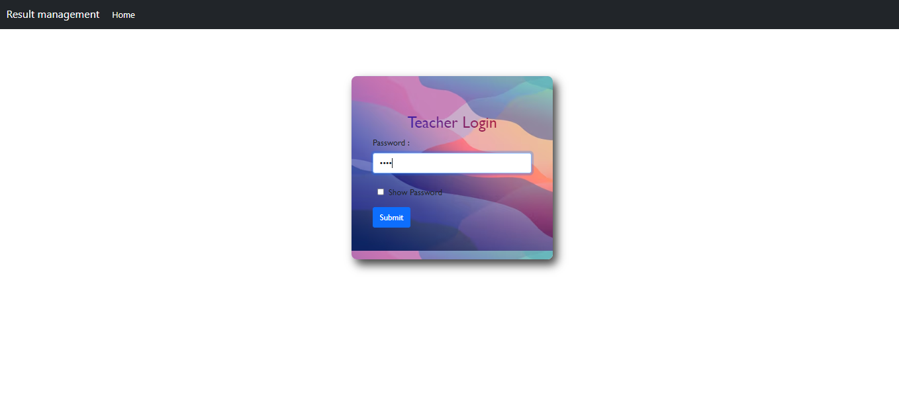
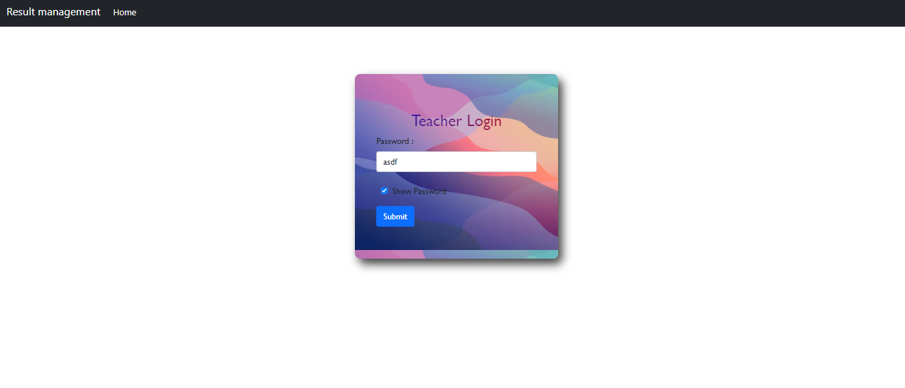
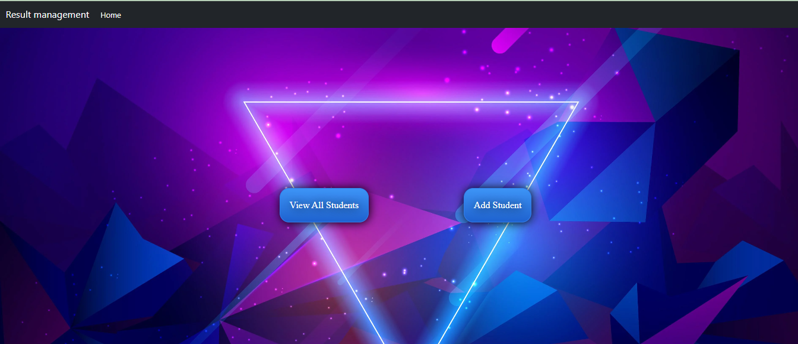
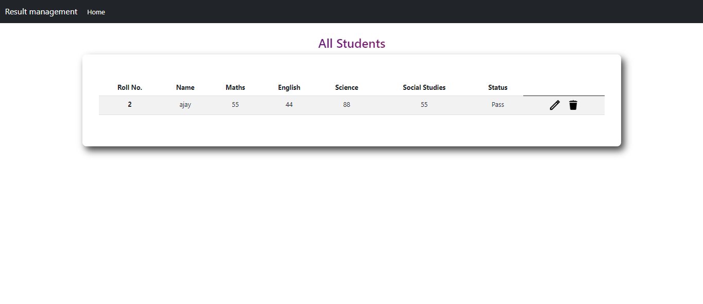
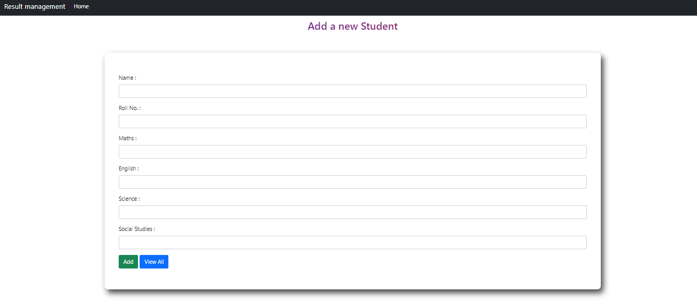

🎓 Student Result Management System 🎓

## Overview


"Here, the teacher has a fixed password 'asdf' and has full access to performing CRUD operations on student details. Students can access their results using their roll number. Passing criteria: Students need to score at least 35 marks in each subject."

This project is a Student Result Management System built using Node.js, Express.js, and MongoDB. It provides functionalities for record management, score card generation, and academic progress tracking.

Note : Teacher has fixed password 'asdf'

🚀 Live Demo

🛠️ Built with

- Node.js
- Express.js
- MongoDB
- HTML
- CSS
- Bootstrap

 • HOME page
  

  • Teacher Login 
  
  
  
  
  
  

📝 Instructions

📥 Clone this repository

```bash
$ git clone https://github.com/yourusername/student-result-management-system.git
```

📂 Navigate to the project directory

```bash
$ cd student-result-management-system
```

🛠 Install dependencies

Make sure you already have Node.js & npm installed on your system.

```bash
$ npm install 
```

### 🚀 Run it

```bash
$ npm start
```

```
✨ Features

- Record Management: Efficiently manage and store student records.
- Score Card Generation: Automatically generate score cards for students.
- Academic Progress Tracking Track academic progress over time.
